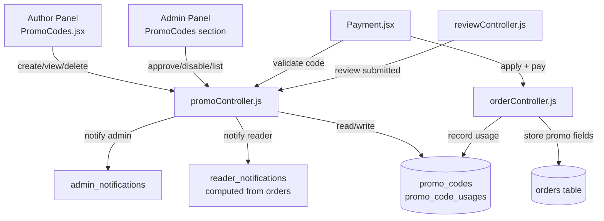

# Design Document: Promo Code System

## Overview

The Promo Code System adds discount code functionality to Pustakyatra. Authors create promo codes for their books, admins approve them, and readers apply them at checkout before paying via eSewa. The discounted total is passed directly to eSewa's payment form.

The system integrates with four existing subsystems:
- **orderController.js** — promo validation and application during checkout
- **reviewController.js** — review_reward notification trigger
- **Payment.jsx** — promo code input UI
- **Admin/Author panels** — promo code management UIs

---

## Architecture



**Request flow for checkout with promo code:**

```
Reader types code → POST /api/promo/validate (returns discount_amount, discounted_total)
                  → Reader confirms → POST /api/orders/initiate-esewa (uses discounted_total)
                  → eSewa callback → POST /api/orders/verify-esewa → record usage
```

---

## Components and Interfaces

### Backend: `promoController.js`

Handles all promo code business logic. Exported functions:

| Function | Route | Auth |
|---|---|---|
| `createPromoCode` | POST /api/author/promo-codes | author |
| `getAuthorPromoCodes` | GET /api/author/promo-codes | author |
| `deletePromoCode` | DELETE /api/author/promo-codes/:id | author |
| `validatePromoCode` | POST /api/promo/validate | reader |
| `getAdminPromoCodes` | GET /api/admin/promo-codes | admin |
| `updatePromoCodeStatus` | PATCH /api/admin/promo-codes/:id/status | admin |
| `checkReviewReward` | (internal, called from reviewController) | — |

### Frontend Components

- **`Frontend/src/pages/author/PromoCodes.jsx`** — author creates, views, and deletes their promo codes
- **Admin promo codes section** — added inside existing `AdminLayout` as a new page/route
- **`Payment.jsx`** — gains a promo code input field + "Apply" button above the total row

### Integration Points

**`orderController.js` changes:**
- `createOrder`: accept optional `promoCodeId`, `discountAmount`, `discountedTotal` in request body; store on `orders` row
- `initiateEsewa`: use `discountedTotal` (if present) instead of `totalAmount` when building eSewa payload
- `verifyEsewa` / `simulatePayment`: after marking order paid, call `recordPromoUsage(promoCodeId, readerId, orderId)` if promo was applied

**`reviewController.js` changes:**
- After inserting a new review (success path), call `checkReviewReward(bookId, readerId)` (non-blocking)

---

## Data Models

### `promo_codes` table

```sql
CREATE TABLE promo_codes (
  promo_code_id      INT PRIMARY KEY AUTO_INCREMENT,
  author_id          INT NOT NULL,
  code               VARCHAR(50) NOT NULL,
  discount_type      ENUM('percentage','flat') NOT NULL,
  discount_value     DECIMAL(10,2) NOT NULL,
  promo_scope        ENUM('all_books','specific_book','rent_only') NOT NULL DEFAULT 'all_books',
  book_id            INT NULL,
  occasion           ENUM('new_launch','dashain','tihar','new_year','teej','first_reader','loyalty','review_reward','low_sales','custom') NOT NULL,
  expiry_date        DATE NOT NULL,
  usage_limit        INT NOT NULL DEFAULT 100,
  per_reader_limit   INT NOT NULL DEFAULT 1,
  minimum_order_amount DECIMAL(10,2) NOT NULL DEFAULT 0,
  usage_count        INT NOT NULL DEFAULT 0,
  status             ENUM('pending','active','disabled') NOT NULL DEFAULT 'pending',
  created_at         TIMESTAMP DEFAULT CURRENT_TIMESTAMP,
  updated_at         TIMESTAMP DEFAULT CURRENT_TIMESTAMP ON UPDATE CURRENT_TIMESTAMP,
  UNIQUE KEY uq_code (code),
  FOREIGN KEY (author_id) REFERENCES authors(author_id) ON DELETE CASCADE,
  FOREIGN KEY (book_id)   REFERENCES books(book_id)   ON DELETE SET NULL
) ENGINE=InnoDB DEFAULT CHARSET=utf8mb4;
```

### `promo_code_usages` table

```sql
CREATE TABLE promo_code_usages (
  usage_id       INT PRIMARY KEY AUTO_INCREMENT,
  promo_code_id  INT NOT NULL,
  reader_id      INT NOT NULL,
  order_id       INT NOT NULL,
  used_at        TIMESTAMP DEFAULT CURRENT_TIMESTAMP,
  FOREIGN KEY (promo_code_id) REFERENCES promo_codes(promo_code_id) ON DELETE CASCADE,
  FOREIGN KEY (reader_id)     REFERENCES readers(reader_id)         ON DELETE CASCADE,
  FOREIGN KEY (order_id)      REFERENCES orders(order_id)           ON DELETE CASCADE
) ENGINE=InnoDB DEFAULT CHARSET=utf8mb4;
```

### `orders` table additions (ALTER)

```sql
ALTER TABLE orders
  ADD COLUMN promo_code_id    INT NULL,
  ADD COLUMN discount_amount  DECIMAL(10,2) NULL DEFAULT 0,
  ADD COLUMN discounted_total DECIMAL(10,2) NULL,
  ADD FOREIGN KEY (promo_code_id) REFERENCES promo_codes(promo_code_id) ON DELETE SET NULL;
```

### Reader Notifications

Reader notifications for `review_reward` are stored in a new `reader_notifications` table (since the existing system computes reader notifications from order data and has no persistent table):

```sql
CREATE TABLE reader_notifications (
  notification_id INT PRIMARY KEY AUTO_INCREMENT,
  reader_id       INT NOT NULL,
  type            VARCHAR(50) NOT NULL,
  message         VARCHAR(500) NOT NULL,
  related_id      INT NULL,
  is_read         TINYINT(1) NOT NULL DEFAULT 0,
  created_at      TIMESTAMP DEFAULT CURRENT_TIMESTAMP,
  FOREIGN KEY (reader_id) REFERENCES readers(reader_id) ON DELETE CASCADE
) ENGINE=InnoDB DEFAULT CHARSET=utf8mb4;
```

---

## Correctness Properties

*A property is a characteristic or behavior that should hold true across all valid executions of a system — essentially, a formal statement about what the system should do. Properties serve as the bridge between human-readable specifications and machine-verifiable correctness guarantees.*

### Property 1: Promo code creation round-trip

*For any* valid promo code creation payload, the stored record SHALL contain all submitted fields with their exact values, and `status` SHALL be `pending`.

**Validates: Requirements 1.1**

---

### Property 2: Code uniqueness is case-insensitive

*For any* promo code string already in the database, attempting to insert the same string in any case variation (upper, lower, mixed) SHALL be rejected.

**Validates: Requirements 1.2, 4.5**

---

### Property 3: Discount value validation

*For any* promo code where `discount_type = 'percentage'` and `discount_value` is outside [1, 100], or where `discount_type = 'flat'` and `discount_value < 1`, creation SHALL be rejected.

**Validates: Requirements 1.5, 1.6**

---

### Property 4: Inactive codes are always rejected at checkout

*For any* promo code with `status = 'pending'` or `status = 'disabled'`, applying it at checkout SHALL be rejected with the appropriate status-specific error message.

**Validates: Requirements 2.4, 2.5, 4.2, 4.3**

---

### Property 5: Discount calculation correctness

*For any* active promo code and cart, the returned `discount_amount` SHALL equal:
- `round((discount_value / 100) * applicable_subtotal, 2)` when `discount_type = 'percentage'`
- `min(discount_value, applicable_subtotal)` when `discount_type = 'flat'`

And `discounted_total` SHALL equal `max(1, cart_total - discount_amount)`.

**Validates: Requirements 5.1, 5.2, 5.6, 3.12**

---

### Property 6: Scope-based applicable subtotal

*For any* cart and promo code:
- `rent_only` scope: discount applies only to items where `item_type = 'rent'`; buy items are excluded
- `specific_book` scope: discount applies only to items matching `book_id`
- `all_books` scope: discount applies to all items belonging to the promo code's author

**Validates: Requirements 1.4, 5.3, 5.4, 5.5**

---

### Property 7: Scope rejection when no applicable items

*For any* promo code and cart where no cart items fall within the code's scope, validation SHALL be rejected with the scope-specific error message.

**Validates: Requirements 3.9, 3.10, 3.11**

---

### Property 8: Usage limit enforcement

*For any* promo code where `usage_count >= usage_limit`, applying it SHALL be rejected with "This promo code has reached its usage limit."

*For any* reader who has used a code `per_reader_limit` times, applying it again SHALL be rejected with "You have already used this promo code the maximum number of times."

**Validates: Requirements 3.6, 3.7**

---

### Property 9: Expiry enforcement

*For any* promo code where `expiry_date` is before the current date, applying it SHALL be rejected with "This promo code has expired."

**Validates: Requirements 3.5, 6.4**

---

### Property 10: Usage recorded only on successful payment

*For any* order where payment fails or is cancelled after a promo code was applied, no record SHALL exist in `promo_code_usages` for that order.

*For any* order where payment succeeds with a promo code applied, exactly one record SHALL exist in `promo_code_usages` with correct `promo_code_id`, `reader_id`, and `order_id`.

**Validates: Requirements 3.4, 7.1, 7.4**

---

### Property 11: Promo fields persisted on order

*For any* order created with a promo code applied, the `orders` record SHALL contain the correct `promo_code_id`, `discount_amount`, and `discounted_total`.

**Validates: Requirements 11.1**

---

### Property 12: Loyalty code eligibility

*For any* loyalty promo code, a reader with no prior paid orders containing books by that code's author SHALL be rejected with "This promo code is for loyal readers who have previously purchased from this author."

**Validates: Requirements 9.1, 9.2**

---

### Property 13: First-reader code eligibility

*For any* first_reader promo code, a reader with one or more prior paid orders on the platform SHALL be rejected with "This promo code is only valid for first-time purchases."

**Validates: Requirements 10.1, 10.2**

---

### Property 14: Review reward notification delivery

*For any* new review submission where the book's author has an active `review_reward` promo code (scoped to `all_books` or the specific `book_id`), a reader notification SHALL be created containing the promo code details.

**Validates: Requirements 8.1, 8.2**

---

### Property 15: Author cannot delete non-pending codes

*For any* promo code with `status = 'active'` or `status = 'disabled'`, an author deletion request SHALL be rejected with "Only pending promo codes can be deleted. Contact admin to disable active codes."

**Validates: Requirements 6.3**

---

## Error Handling

| Scenario | HTTP Status | Message |
|---|---|---|
| Code not found | 404 | "Invalid promo code." |
| Status pending | 400 | "This promo code is not yet active." |
| Status disabled | 400 | "This promo code is no longer valid." |
| Expired | 400 | "This promo code has expired." |
| Usage limit reached | 400 | "This promo code has reached its usage limit." |
| Per-reader limit reached | 400 | "You have already used this promo code the maximum number of times." |
| Minimum order not met | 400 | "Minimum order amount of Rs [amount] is required for this promo code." |
| Scope mismatch (specific_book / all_books) | 400 | "This promo code is not valid for the items in your cart." |
| Scope mismatch (rent_only) | 400 | "This promo code is only valid for rental orders." |
| Loyalty ineligible | 400 | "This promo code is for loyal readers who have previously purchased from this author." |
| First-reader ineligible | 400 | "This promo code is only valid for first-time purchases." |
| Duplicate code | 409 | "A promo code with this name already exists." |
| Invalid discount_value | 400 | "Percentage discount must be between 1 and 100." / "Flat discount must be at least Rs 1." |
| Past expiry_date on creation | 400 | "Expiry date cannot be in the past." |
| Delete non-pending code | 400 | "Only pending promo codes can be deleted. Contact admin to disable active codes." |
| book_id not owned by author | 403 | "The selected book does not belong to your account." |

All validation errors are returned as `{ success: false, message: "..." }`. The `validatePromoCode` endpoint runs all checks in order (status → expiry → usage limit → per-reader limit → minimum order → scope → occasion-specific) and returns the first failing check.

---

## Testing Strategy

### Unit Tests (example-based)

- Admin approve/disable transitions (2.1, 2.2)
- Author list returns correct fields (6.1)
- Author delete pending code succeeds (6.2)
- Admin notification created on code creation (1.8)
- No review_reward notification when no matching code (8.3)
- Admin payments endpoint returns promo fields (11.2)
- Reader order history returns promo fields (11.3)

### Property-Based Tests

Using **fast-check** (JavaScript) with minimum 100 iterations per property.

Each test is tagged with: `// Feature: promo-code-system, Property N: <property_text>`

| Property | Generator inputs | Assertion |
|---|---|---|
| P1: Creation round-trip | Random valid code payloads | Stored record matches all fields, status = pending |
| P2: Case-insensitive uniqueness | Random code strings | Second insert (any case) rejected |
| P3: Discount value validation | Values outside valid ranges | Creation rejected |
| P4: Inactive codes rejected | Pending/disabled codes + any cart | Checkout validation rejected with correct message |
| P5: Discount calculation | Random discount_value, subtotals | Formula holds, discounted_total >= 1 |
| P6: Scope-based subtotal | Random carts with mixed item types | Only applicable items discounted |
| P7: Scope rejection | Codes + carts with no applicable items | Rejected with scope-specific message |
| P8: Usage limits | Codes at/over limits, readers at per-reader limit | Rejected with correct messages |
| P9: Expiry enforcement | Codes with past expiry_date | Rejected with expiry message |
| P10: Usage recording | Successful/failed payments with promo | Usage record exists iff payment succeeded |
| P11: Order promo fields | Orders with promo applied | orders row has correct promo fields |
| P12: Loyalty eligibility | Loyalty codes + readers with/without prior orders | Ineligible readers rejected |
| P13: First-reader eligibility | First_reader codes + readers with/without prior orders | Readers with prior orders rejected |
| P14: Review reward notification | Reviews on books with/without review_reward codes | Notification created iff code exists |
| P15: Author delete restriction | Active/disabled codes + delete request | Rejected with correct message |

### Integration Tests

- eSewa payment flow passes `discounted_total` as the amount (mock eSewa endpoint, verify payload)
- Full checkout flow: validate → create order → simulate payment → verify usage recorded
